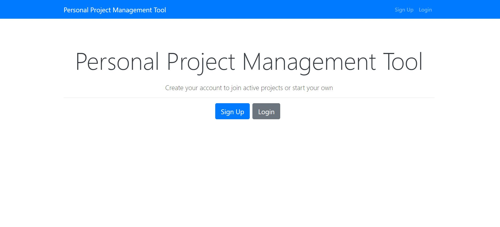
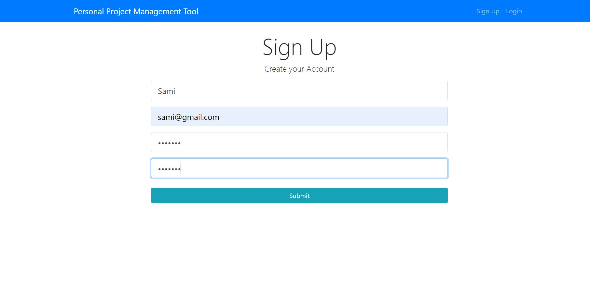
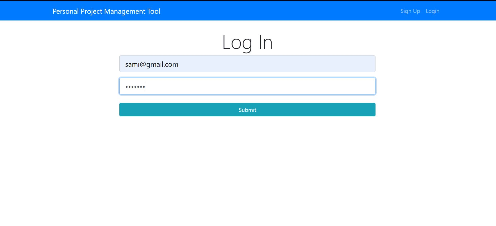
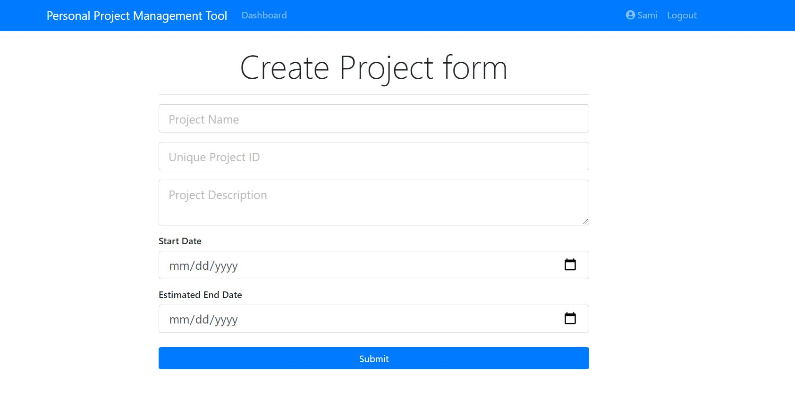
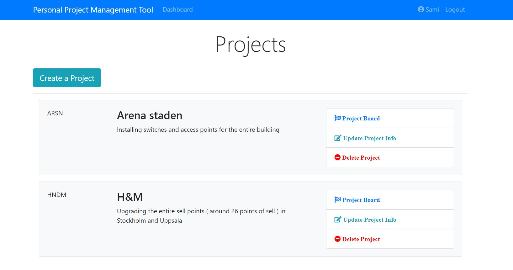
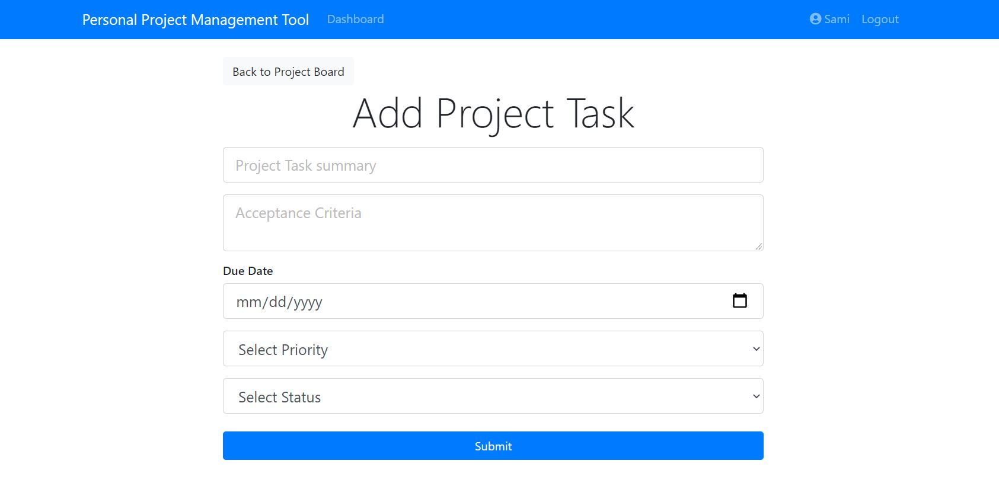
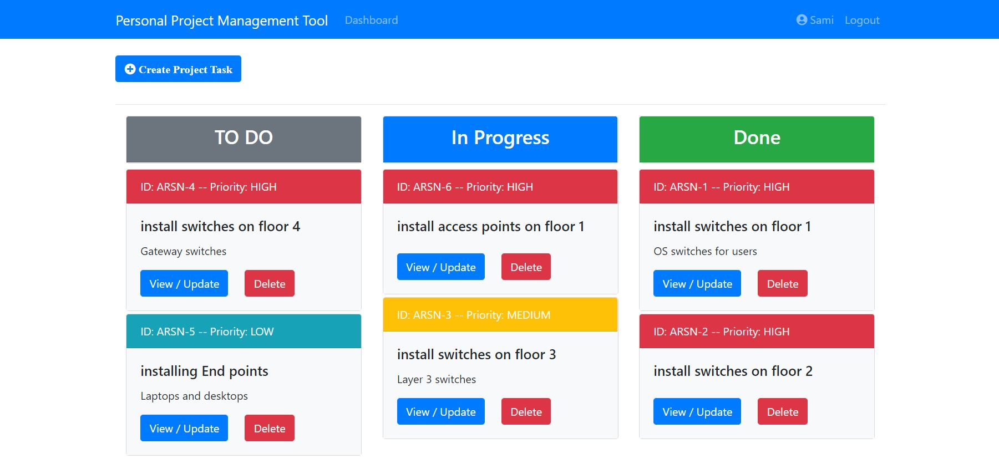

# Project management webapp

A project management where different users can access their own project and preform all CRUD operations. The backend is a Rest API written in java using Spring Boot .
Authentication is implemented by Spring security JWT.
The frontend is build using React.

## Authors

- [@SamiHasAb](https://github.com/SamiHasAb)

  
## Screenshots

  